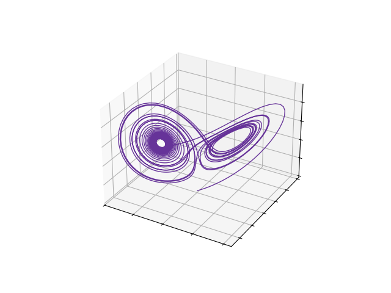
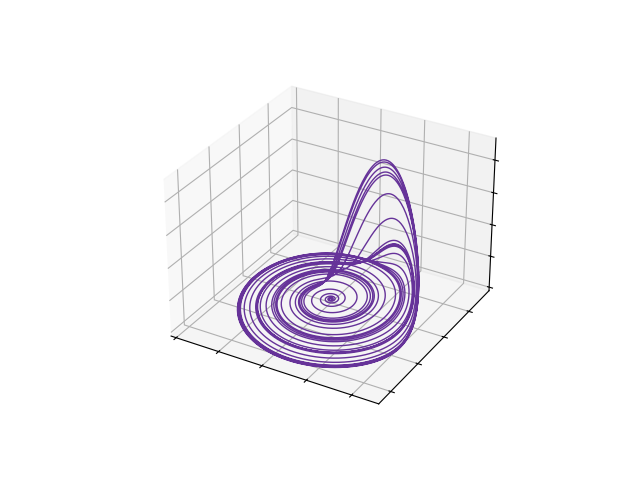
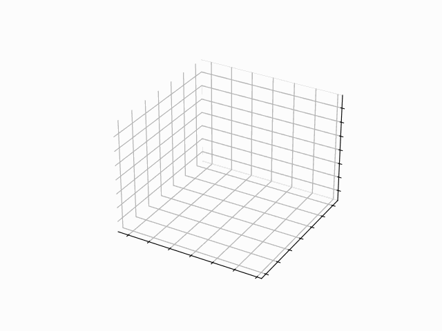

# Strange Attractors
#### Video Demo : https://youtu.be/ywYBEGUPElQ

## Contents
1. [Overview](#overview)
2. [Usage](#usage)
    + [Install Libraries](#install-libraries)
    + [Command Line Interface](#command-line-interface)
    + [Running The Application](#running-the-application)
    + [Help](#help)
    + [Examples](#examples)
3. [Project Structure](#project-structure)
    + [Directories](#directories)
    + [Files](#files)
4. [Notes](#notes)
    + [Main Languages & Libraries Used](#main-languages--libraries-used)
    + [Thoughts](#thoughts)
    + [Potential Improvements](#potential-improvements)
    + [References](#references)

## Overview
<p align="justify">
Welcome !
Strange Attractors is a simple Python application which simulates and visualises strange attractors.
</p>

<p align="justify">
The application simulates a chosen strange attractor for a chosen amount of time, using the 4th order Runge-Kutta (RK4) method.
It can then produce either a three-dimensional plot or a three-dimensional animation of the simulated strange attractor.
</p>

## Usage
### Install Libraries
<p align="justify">
The requirements.txt file contains all of the required libraries for the application.
These libraries can be installed using the following pip command.
</p>

```
pip install -r requirements.txt
```

### Command Line Interface
<p align="justify">
This application is controlled through the command line interface and the following three command line arguments are required to run the application.
The available options for each of the command line arguments are also shown below.
</p>

#### Command Line Arguments
+ **Attractor** : The strange attractor that should be simulated.
+ **Output** : The output format of the simulation.
+ **Time** : The total time of the simulation.

#### Attractor Options
+ **Langford**
+ **Lorenz**
+ **Rossler**
+ **Sprott**

#### Output Options
+ **Animation**
+ **Image**

#### Time Options
+ **Animation** : 1 - 60 seconds.
+ **Image** : 1 - 600 seconds.

> [!CAUTION]
> The "time" argument should be an integer.

> [!IMPORTANT]
> The maximum allowed time for a simulation using the "animation" output is 60 seconds.
> The maximum allowed time for a simulation using the "image" output is 600 seconds.

> [!NOTE]
> The "animation" output produces a gif file and the "image" output produces a png file.

### Running The Application
<p align="justify">
To run the application, the following command should be used along with the desired command line arguments substituted in.
</p>

```
python project.py attractor output time
```

### Help
The ```-h``` or ```--help``` command line arguments can also be used to get help with how to use the application, as shown below.

```
python project.py -h
```

```
usage: project.py [-h] {langford,lorenz,rossler,sprott} {animation,image} time

positional arguments:
  {langford,lorenz,rossler,sprott}
                        strange attractor to be simulated
  {animation,image}     output format of simulation
  time                  total time of simulation {animation : 1-60, image : 1-600}

options:
  -h, --help            show this help message and exit
```

### Examples
+ **Example 1** : Simulation of a Lorenz attractor for 30 seconds, with an image output.

```
python project.py lorenz image 30
```

<p align="center">
  
</p>

+ **Example 2** : Simulation of a Rossler attractor for 180 seconds, with an image output.

```
python project.py rossler image 180
```

<p align="center">
  
</p>

+ **Example 3** : Simulation of a Sprott attractor for 30 seconds, with an animation output.

```
python project.py sprott animation 30
```

<p align="center">
  
</p>

+ **Example 4** : Simulation of a Langford attractor for 60 seconds, with an animation output.

```
python project.py langford animation 60
```
<p align="center">
  
</p>


## Project Structure
### Directories
+ ```attractors``` : A Python package which contains modules that define classes for strange attractors.
+ ```demo``` : Contains demo images and animations produced from the application.

### Files
#### Root
+ ```project.py``` : The main Python script for the application which contains most of the code.
+ ```test_project.py``` : Contains unit tests for some of the functions in ```project.py```.
+ ```requirements.txt``` : Contains the required libraries for the application.
+ ```README.md``` : The READEME file for the application.

#### Attractors
+ ```__init__.py``` : Defines this directory as a Python package.
+ ```langford.py``` : Contains the class for the Langford attractor.
+ ```lorenz.py``` : Contains the class for the Lorenz attractor.
+ ```rossler.py``` : Contains the class for the Rossler attractor.
+ ```sprott.py``` : Contains the class for the Sprott attractor.

#### Demo
+ ```animations``` : Contains demo animations produced from the application.
+ ```images``` : Contains demo images produced from the application.

## Notes
### Main Languages & Libraries Used
+ **Python**
+ **Matplotlib**

### Thoughts
<p align="justify">
There was a shortcoming in terms of the animation output feature of the application.
To begin with, the application uses the PillowWriter to create animations instead of the more efficient FFMpegWriter, as FFmpeg is not available in CS50's codespaces.
The first issue this creates is that animations are outputted as GIF files instead of MP4 files, as the PillowWriter does not support the MP4 file format.
This is an issue as GIF files are not optimised for long animations/videos, due to the compression techniques used in GIF files, which also causes GIF files to be much larger in size than MP4 files.
The second issue that arises with using the PillowWriter is that it is slower and less efficient than the FFMpegWriter when generating animations/videos, as it is not a pipe-based writer.
This meant that during testing, creating an animation with 5000 frames caused the computational limits of CS50's codespaces to be reached, which caused the application to be stopped.
Therefore, this introduced some limitations when implementing the animation output feature of the application, in particular a maximum limit of 3000 frames is enforced for animations.
This is done through using a step size of 0.02 for the RK4 (4th order Runge-Kutta) method and setting a maximum simulation time of 60 seconds, when generating animations (60 / 0.02 = 3000).
<i>For images, a step size of 0.01 is used for the RK4 method and a maximum simulation time of 600 seconds is set.</i>
Without the limitations of having to use the PillowWriter, it could be possible to allow a larger maximum simulation time when generating animations.
</p>

<p align="justify">
This application was made for the final project of CS50P, and I chose to make this application due to an interest in scientific computing.
I wanted to practise implementing a numerical method of solving differential equations, while also gaining practise with using libraries such as Matplotlib.
</p>

### Potential Improvements
+ Implement more strange attractors to simulate and visualise.
+ Implement the plotting of two-dimensional plots and animations, such as x against z.
+ Allow users to customise the parameters of each strange attractor, such as beta, rho and sigma for the Lorenz attractor.
+ Allow users to customise the initial coordinates of each strange attractor.
+ Allow users to customise plots, such as selecting line colour, view angle, axis labels etc.

### References
+ Runge-Kutta Method : https://web.mit.edu/10.001/Web/Course_Notes/Differential_Equations_Notes/lec24.html
+ Strange Attractor Equations & Parameter Values : https://www.dynamicmath.xyz/strange-attractors/
